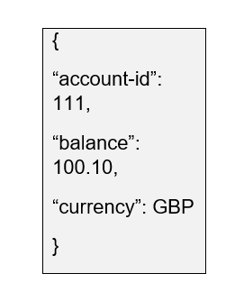
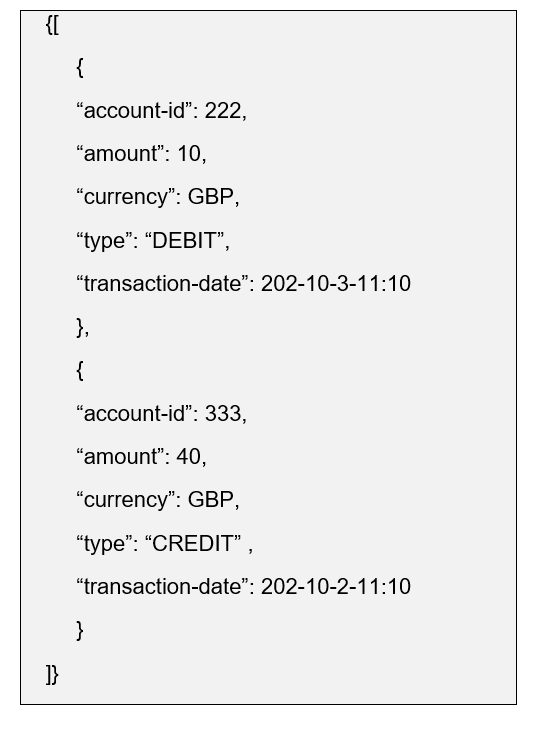

Instructions
Please read through the instructions in full before starting this challenge. This challenge is designed to assess your approach to a task and design thinking within a limited time.

Intra Bank Payment Transfer System

Technology Guidelines:

Application should be written in Java-8 (or greater) and Spring Framework

All the webservice APIs should be following Restful API architecture

JSON should be used as the data serialisation format

Where possible code it against interfaces and provide mock implementation such as account service

Use in-memory data-structure to store all the data

All the classes, methods should be clearly documented

Code coverage should be above 80%

Use of open-source libraries such as Lombok, Guava is permitted

Try to use Maven based project structure

Completed exercise should either be uploaded to private Git repo (GitHub/Bitbucket/GitLab) or zip the entire project directory and email to the Mastercard Recruitment Team.

Modern Bank PLC would like to create a new intra-bank payment transfer system to allow real time payments between internal accounts.

High Level Requirements

System should be:

accessible by Restful Webservices

able to tell account balance in real time

able to get mini statement for last 20 transactions

able to transfer money in real time

able to fetch accounts details from accounts service (new / deleted)

Acceptance Criteria:

Given valid account details and positive funds available

When account-id 111 sends £10 to account-id 222

Then account-111’s account should be debited with £10

And account-222’s account should be credited with £10

Given invalid receiver account details and positive funds available

When account-id 111 sends £10 to account-id 999

Then system should reject the transfer and report invalid account

details

Given valid account details and no funds available (£0)

When account-id 111 sends £10 to account-id 222

Then system should reject the transfer with error Insufficient

funds available

Given valid account details

When I call a service to check my account balance

Then system should be able to report my current balance

Given valid account details

When I call mini-statement service

Then system should be able to show me last 20 transactions

Given invalid account details

When I call a service to check my account balance

Then system should return error saying invalid account number

Given invalid account details

When I call mini statement service

Then system should return error saying invalid account number

API example for payment transfer:

URI: http://localhost:8080/accounts/111/balance

Output

enter image description here

URI: http://localhost:8080/accounts/111/statements/mini

Output:

